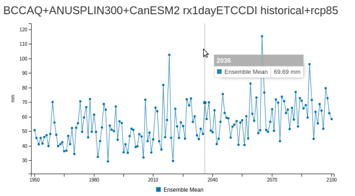

.. PCIC Climate eXplorer documentation master file, created by
   sphinx-quickstart on Wed Mar 30 11:31:24 2016.
   You can adapt this file completely to your liking, but it should at least
   contain the root `toctree` directive.

Welcome to PCIC Climate eXplorer's documentation!
=================================================

Introduction
------------
[ SOME INTRO NEEDED FIRST ] 

Selecting Climate Variables and Emission Scenarios
--------------------------------------------------
The use of the PCIC Climate eXplorer web user interface (webUI) is driven primarily by the two drop-down selectors across the top: **Variable Selection** and **Emission Scenario Selection**. **Variable Selection** gives the user the choice of which climate variable will be displayed within the **Map**, **Plot**, and **Summary Table** panes (to be described in the following sections), and **Emission Scenario Selection** specifies the modeled Representative Concentration Pathway (RCP) to be viewed, which may include historical recorded values in addition to future projections. 

Using the Map
-------------
The **Map** pane at the left of the webUI has two main functions, 1) to allow the user to select an area of analysis, and 2) to display selected climate variable data spatially. The image below indicates the map controls available to the user. 

The "zoom" control will change the displayed map extents, but does not set or affect the area of analysis. 

The two buttons annotated "select map area" allow the user to draw custom polygons or rectangles on the map, which then set the area of analysis (for which the data displayed in the **Plot** and **Summary Table** are generated). 

The buttons annotated "edit analysis area" allow for a polygon/rectangle created by the user to be edited or deleted. 

The "map options" button will open a pop-up dialog box with the following options: *Time Selection*, *Color Pallette*, and *Color scale*.  *Time Selection* allows the user to set the specific time step (the annual midpoint for one year) for which to display colour-scaled annual average data spatially on the map. *Color Pallette* and *Color Scale* allow the user to try different map colour display options for better data visualisation. 

The "export polygon" button allows the user to export a polygon/rectangle currently existing in the map pane (the area of analysis) to a number of common geospatial data formats (Shapefile, GeoJSON, WKT, KML, and GPX), which can be then read by other geospatial software packages. The corallary of this is the "import polygon" button, which allows for polygons created by another geospatial software package to be imported for defining the area of analysis.

Using the Plots
---------------
The **Plot** pane is located on the right side of the webUI, and is populated with annual average data defined by user input to the **Variable Selection** and **Emission Scenario Selection** drop-down selectors, across the spatial extents of the area selected within the **Map** (if no area was selected, an average for all of Canada is provided). The title at the top of the plot indicates the source model / ensemble of the displayed data as well as the selected variable and emission scenario. Units of measurement are shown beside the vertical axis (e.g. temperature may be in *degrees_C*, or *K* for degrees Kelvin). The horizontal axis gives the time associated with the data points, in units of years. Moving the mouse cursor over the plot area will reveal a tooltip that provides the specific data values and time step for each data point. The colour-coded plot legend is given below the horizontal axis. Clicking on a legend label will toggle the visibility of the particular data series within the plot. 

Using the Summary Table
----------------------------
The **Summary Table** is located on the lower right of the webUI and displays model run details and statistical values for the data series shown in the **Plot**. Clicking on a column header will sort the table according to the values in that column. Two buttons immediately below give the option for the user to export and download the contents of the **Summary Table** into spreadsheet format (either XLSX or CSV), along with headers indicating the model, variable, and emission scenario. 

Guide to the web API
--------------------

The PCIC Climate eXplorer has a strict separation between the web user interface (webUI) and the backend. The backend provides all the information that the webUI presents. There are many advantages to this architecture, one being that the user may query the backend directly using the web API and a standard HTTP request.

The web API's URL consists of the following pattern: http://base_url/api/[request_type]?[query_string_parameters] For example a standard multimeta request at our demo site may be found at the URL http://docker1.pcic.uvic.ca:12000/api/metadata? There are presently 6 request types documented in the sections below.

Each different request accepts a different set of parameters. Request arguments are accepted through the `HTTP query string parameters <https://en.wikipedia.org/wiki/Query_string>`_.

All responses from the web API are returned as encoded `JSON <http://json.org/>`_ objects, typically as nested key/value pairs.

Making a request can be as simple as typing the URL into your web browser, or using `curl <https://en.wikipedia.org/wiki/CURL>`_ from the command line. For example, if one wanted to request all of the metadata available for model_id ``txxETCCDI_aMon_CanESM2_rcp85_r5i1p1_20700101-20991231``, the following could be executed from the command line::

   $ curl -s "docker1.pcic:12000/api/metadata?"\
   "model_id=txxETCCDI_aMon_CanESM2_rcp85_r5i1p1_20700101-20991231" |\
   python -m json.tool
   {
       "txxETCCDI_aMon_CanESM2_rcp85_r5i1p1_20700101-20991231": {
           "ensemble_member": "r5i1p1",
           "experiment": "rcp85",
           "institution": "CCCma",
           "model_id": "CanESM2",
           "model_name": null,
           "times": {
               "0": "2085-01-16T00:00:00Z",
               "1": "2085-02-15T00:00:00Z",
               "10": "2085-11-16T00:00:00Z",
               "11": "2085-12-16T00:00:00Z",
               "12": "2085-01-15T00:00:00Z",
               "13": "2085-04-17T00:00:00Z",
               "14": "2085-07-17T00:00:00Z",
               "15": "2085-10-17T00:00:00Z",
               "16": "2085-07-02T00:00:00Z",
               "2": "2085-03-16T00:00:00Z",
               "3": "2085-04-16T00:00:00Z",
               "4": "2085-05-16T00:00:00Z",
               "5": "2085-06-16T00:00:00Z",
               "6": "2085-07-16T00:00:00Z",
               "7": "2085-08-16T00:00:00Z",
               "8": "2085-09-16T00:00:00Z",
               "9": "2085-10-16T00:00:00Z"
           },
           "timescale": "other",
           "variables": {
               "txxETCCDI": "Monthly Maximum of Daily Maximum Temperature"
           }
       }
   }

The following sections provide further details about the arguments that are accepted and required by each of the API calls.

metadata
^^^^^^^^

.. autofunction:: ce.api.metadata.metadata

multimeta
^^^^^^^^^

The ``multimeta`` API call is available to retrieve summarized metadata from all data files in a given ensemble, optionally filtered by the name of some model.

Unlike the ``metadata`` API call, ``multimeta`` omits information about the timesteps which are available. To discover this information, one is required to make a follow-up all to ``metadata`` for the specific unique_id in question.

.. autofunction:: ce.api.multimeta.multimeta

stats
^^^^^

.. autofunction:: ce.api.stats.stats

multistats
^^^^^^^^^^

.. autofunction:: ce.api.multistats.multistats

data
^^^^

.. autofunction:: ce.api.data.data

timeseries
^^^^^^^^^^

.. autofunction:: ce.api.timeseries.timeseries

Contents:

.. toctree::
   :maxdepth: 2

Indices and tables
==================

* :ref:`genindex`
* :ref:`modindex`
* :ref:`search`

